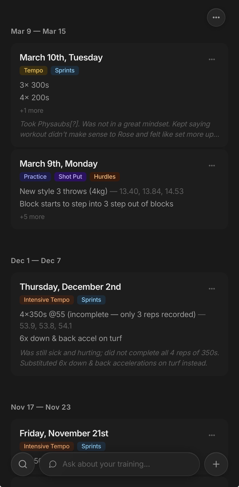
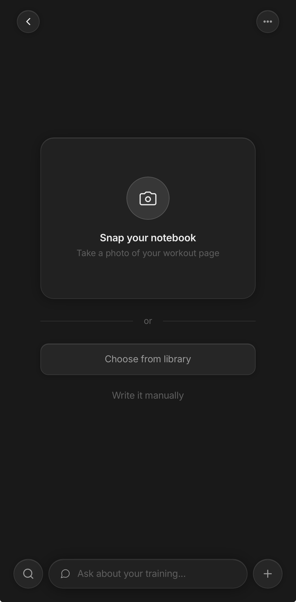
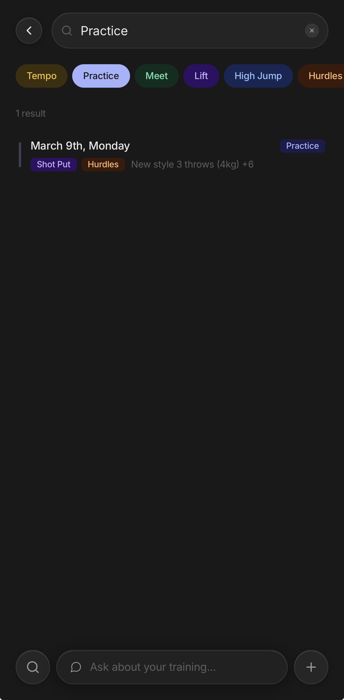
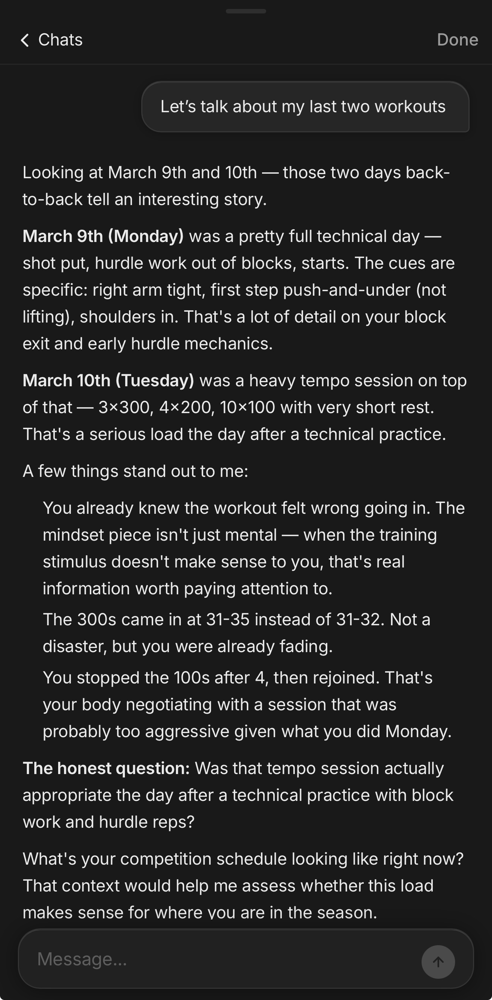

# trainbook

A mobile-first training journal that turns handwritten workout notes into structured, searchable data using AI vision — then lets you chat with your training history.

Built for track & field athletes who keep handwritten notebooks and want to digitize them without losing the detail.

<p align="center">
  
  
  
  
</p>

## How it works

1. **Snap** a photo of your handwritten workout page
2. **AI extracts** the data — exercises, times, sets, reps, technical cues, notes
3. **Review and confirm** the extraction (edit anything that's wrong)
4. **Browse** your journal as a searchable feed grouped by week
5. **Ask AI** questions about your training history in natural language

## Features

- **AI vision extraction** — Claude Sonnet reads handwritten workout notes and outputs structured data. Handles messy handwriting, abbreviations, split times, and coaching cues.
- **Journal feed** — chronological workout entries grouped by week. Tap to expand full detail. Three-dot menu for edit, delete, or "Ask AI about this workout."
- **Search with filters** — full-text search across dates, workout types, events, exercises, and notes. Quick-filter chips for common categories. Tap results to expand inline.
- **AI chat** — persistent conversation threads backed by your full workout history. The AI knows your training patterns, recurring technique cues, and injury timeline. Markdown rendering with tables, lists, and formatting.
- **Dashboard** — this week vs last week stats, running volume trend, event balance visualization, neglected events, and recurring technical cues.
- **Manual entry** — not everything comes from a photo. Write workouts directly when needed.
- **Dark mode** — Notion-inspired dark theme with liquid glass UI elements.
- **Mobile-first PWA** — designed for iPhone. Add to home screen for a native app experience.

## Tech stack

| Layer | Technology |
|-------|-----------|
| Framework | [Next.js](https://nextjs.org) 16 (App Router) |
| Language | TypeScript |
| Styling | Tailwind CSS + custom CSS properties |
| Auth / DB / Storage | [Supabase](https://supabase.com) (Postgres, Auth, Storage, RLS) |
| AI Vision | [Anthropic](https://anthropic.com) Claude Sonnet (handwriting extraction) |
| AI Chat | [Vercel AI SDK](https://sdk.vercel.ai) (streaming, model-agnostic) |
| Charts | [Recharts](https://recharts.org) |
| Markdown | [react-markdown](https://github.com/remarkjs/react-markdown) + remark-gfm |
| Deployment | [Vercel](https://vercel.com) |

## Architecture

```
app/
  (auth)/login, signup          Auth pages (Supabase Auth)
  (app)/
    feed/                       Journal feed with weekly grouping
    upload/                     Camera capture + AI extraction + confirm
    dashboard/                  Training analytics
  api/
    extract/                    Image -> Claude Sonnet vision -> structured JSON
    chat/                       Streaming chat with workout context retrieval

components/
  bottom-nav                    Floating glass nav (search, AI chat, new entry)
  top-bar                       Floating back button + settings menu
  workout-card                  Expandable entry with three-dot context menu
  workout-form                  Editable fields for extraction confirm + edit
  workout-pill                  Color-coded type/event badges
  chat-panel                    Full-screen chat with persistent threads
  volume-chart                  Weekly running volume bar chart
  event-heatmap                 Heptathlon event coverage grid

lib/
  supabase/                     Client + server Supabase helpers
  types.ts                      Workout, Exercise TypeScript types
  extraction-prompt.ts          Claude vision prompt for handwriting
  workout-utils.ts              Volume calculation, summary builder
  workout-colors.ts             Color system for workout type/event pills
  search-context.tsx            Search state management
  chat-context.tsx              Workout attachment for AI chat
```

## Data model

The core `workouts` table stores each training entry:

```sql
workouts (
  id, user_id, date, date_iso,
  workout_type,                   -- Tempo, Practice, Meet, Lift, etc.
  event_focus[],                  -- High Jump, Hurdles, Sprints, etc.
  exercises (jsonb),              -- [{description, distance, reps, sets, times[], rest, notes}]
  technical_cues[],               -- Coaching notes
  personal_notes,                 -- How it felt, injuries, conditions
  raw_text,                       -- Original AI transcription
  image_path,                     -- Reference to uploaded photo
  embedding                       -- Vector for semantic search (future)
)
```

Row-level security ensures users only access their own data. Chat threads persist in `chats` + `chat_messages` tables.

## Getting started

### Prerequisites

- Node.js 18+
- A [Supabase](https://supabase.com) project (free tier works)
- An [Anthropic](https://console.anthropic.com) API key

### Setup

```bash
# Clone
git clone https://github.com/yourusername/trainbook.git
cd trainbook

# Install
npm install

# Environment
cp .env.example .env.local
# Fill in your Supabase URL, anon key, and Anthropic API key
```

### Database

Run the SQL migrations against your Supabase project (via the SQL editor in the dashboard):

1. `supabase/migrations/001_create_workouts.sql` — workouts table + RLS + pgvector
2. `supabase/migrations/002_create_storage.sql` — image storage bucket + RLS
3. `supabase/migrations/003_create_chats.sql` — chat threads + messages + RLS

### Run

```bash
npm run dev
```

Open on your phone (use your local IP) or in mobile device mode in devtools.

### Deploy

```bash
npx vercel --prod
```

Set environment variables in the Vercel dashboard.

## Design decisions

**Why AI vision instead of manual entry?** Athletes already have a notebook workflow. Forcing them into a form-based app means they either stop using the notebook or stop using the app. This meets them where they are.

**Why dark mode only?** The target user is at the track, often in bright sunlight. Dark mode with high contrast is more readable outdoors. It also matches the Notion/Obsidian aesthetic the app targets.

**Why not a native app?** PWA gives us camera access, home screen installation, and full-screen experience without the App Store. For a training journal, the web platform is sufficient and deployment is instant.

**Why store exercises as JSONB?** Exercises are always read/written with their parent workout, never queried independently. A separate table would add complexity (joins, migrations) for zero practical benefit.

## License

MIT
